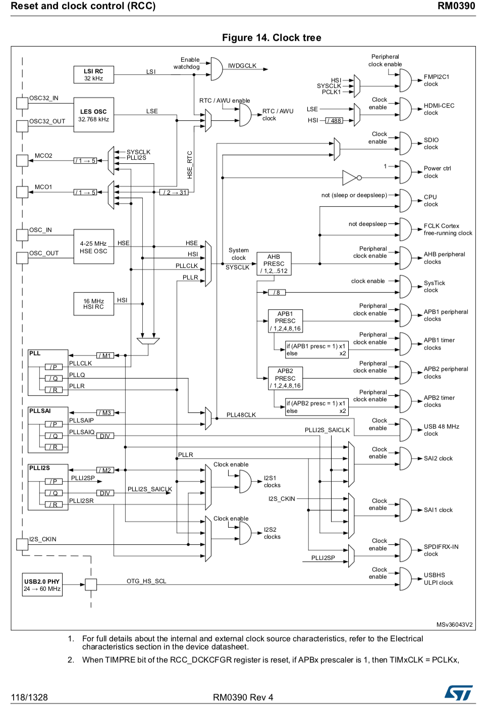
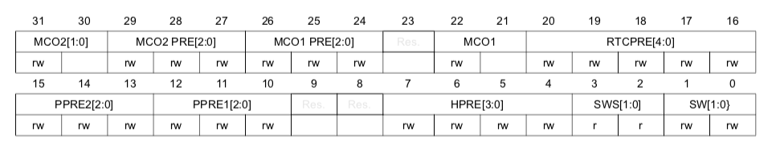
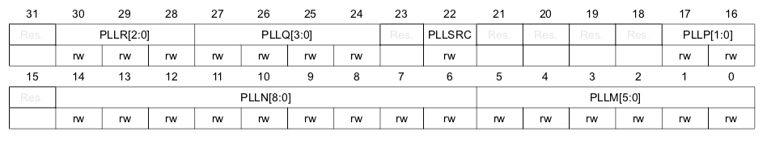
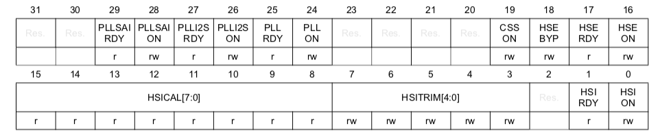

# ReadMe

## startup_stm32f446xx.s

- [STM32 Nucleo Boardスタートアップルーチン - Qiita](https://qiita.com/mitazet/items/54713ec4e89f0b57ac6e)

### 1
```
.syntax unified   /* 統合アセンブリ構文によって書かれている*/
.cpu cortex-m4    /* cortex-m4 */
.fpu softvfp      /* ソフトウェア浮小数点リンケージ指定 */
.thumb            /* 後続の命令をT32として解釈 */
```

### 2

```
.global g_pfnVectors
.global Default_Handler
```

>.globalでg_pfnVectors、Default_Handlerラベルを他のオブジェクトファイルでも利用可能なように公開している。

??? 

### 3
```
.word   _sidata
.word   _sdata
.word   _edata
.word   _sbss
.word   _ebss
```

>_sidata/_sdata/_edata/_sbss/_ebssはリンカスクリプトで定義されている値。   

???

startup_stm32f446xx.sにおける記述のtransrate

```
/ * .dataセクションの初期化値の開始アドレス。
リンカースクリプトで定義されています* /
.word _sidata
/ * .dataセクションの開始アドレス。 リンカースクリプトで定義されています* /
.word _sdata
/ * .dataセクションの終了アドレス。 リンカースクリプトで定義されています* /
.word _edata
/ * .bssセクションの開始アドレス。 リンカースクリプトで定義されています* /
.word _sbss
/ * .bssセクションの終了アドレス。 リンカースクリプトで定義されています* /
.word _ebss
/ * SystemInit_ExtMemCtlに使用されるスタック。 常に内部RAM使用* /
```

```
.equ  BootRAM,        0xF1E0F85F
```

>.equディレクティブを使うとこのファイル中ではBootRAMという文字列が0xF1E0F85Fに置き換えられる。

[ARM コンパイラツールチェーン アセンブラリファレンス - EQU](http://infocenter.arm.com/help/index.jsp?topic=/com.arm.doc.dui0489fj/Caccddic.html)

ARMのリファレンスだと､"name EQU expr{, type}"という構文で､nameは割り当てるシンボル､exprはレジスタ相対アドレス、PC 相対アドレス、絶対アドレス、または 32 ビット整数定数を指定､typeはexprが絶対アドレスのときのみ使用でき､オプションとして指定できる｡

この場合､bootRAMというシンボルが0xF1E0F85Fという値に読み替えられるというdefine的役割を持つものと思われる｡

**F446スタートアップにはこの文言がない**

このあと､初期化宣言ありの変数となしの変数を保存する領域を決定してSystemInit,main文を呼び､ベクタテーブルを定義して終了する｡


 ## RCC クロックの設定

   
  Fig14 クロックツリー図 from リファレンスマニュアル RM0390 Rev 4 P.118


## RCC CFGR
  
RCC RCC_CFGR

 - MCO系 マイクロコントローラ クロック アウトプット 
 - 20-16 RTCPRE RTC用のHSEクロックのプリスケーラ
 - 15-13 OORE2 APB2 ハイスピード ペリフェラル クロックバス プリスケーラ 
    -   0xx: AHB clock not divided 
    -   100: AHB clock divided by 2 
    -   101: AHB clock divided by 4 
    -   110: AHB clock divided by 8 
    -   111: AHB clock divided by 16
- 12-10 PPRE1 APB1 ロースピード ペリフェラル クロックバス プリスケーラ
    - 0xx: AHB clock not divided 
    - 100: AHB clock divided by 2 
    - 101: AHB clock divided by 4 
    - 110: AHB clock divided by 8 
    - 111: AHB clock divided by 16
- 7-4 HPRE AHB プリスケーラ
    - 0xxx: system clock not divided
    - 1000: system clock divided by 2
    - 11001: system clock divided by 4
    - 11010: system clock divided by 8 
    - 1011: system clock divided by 16 
    - 1100: system clock divided by 64 
    - 1101: system clock divided by 128 
    - 1110: system clock divided by 256 
    - 1111: system clock divided by 512
 - 3-2 SWS システムクロック スイッチ ステータス(読み取り専用)
    - 00: HSI oscillator used as the system clock
    - 01: HSE oscillator used as the system clock
    - 10: PLL used as the system clock
    - 11: PLL_R used as the system clock
  - 1-0 SW システムクロック スイッチ
    - 00: HSI oscillator selected as system clock
    - 01: HSE oscillator selected as system clock
    - 10: PLL_P selected as system clock 
    - 11: PLL_R selected as system clock
    
## RCC PLLCFGR



- 30-28 PLLR I2S,SAI,SysClockに設定できるPLLのディバイダ VCO frequency / PLLR with 2 􏰇 PLLR 􏰇 7
- 27-24 PLLQ SDIO,USB等へ設定できるPLLのディバイダ VCO frequency / PLLQ with 2 􏰇 PLLQ 􏰇 15
- 22 PLLSRC PLLとPLLI2Sのクロックソースセレクタ?
    - 0 HSI(内部)をPLLとPLLI2Sのクロックに選択する
    - 1 HSE(外部)をPLLとPLLI2Sのクロックに選択する
- 17-16 PLLP PPLのP(3番目)ディバイダ VCO frequency / PLLP with PLLP = 2, 4, 6, or 8
    - ※ここで180MHzを超えないよう正しくビットを設定しなければならない｡ 
    - 00: PLLP = 2
    - 01: PLLP = 4
    - 10: PLLP = 6 
    - 11: PLLP = 8
- 14-6 PLLN PLLのN(2番目)の逓倍器｡VCO input frequency × PLLN with 50 􏰇 PLLN 􏰇 432
    - ※PLLが停止中に書き込むことができる｡ハーフワードまたはワードアクセスのみ｡ 
    - 0 0011 0010(50) < PLLN < 1 1011 0001(433) の範囲内の9bit
    - Note:入力が1MHz以上でなければならない？
- 5-0 PLLM PLLのM(1番目)ディバイダ
    - ソフトウェアは、これらのビットを正しく設定して、VCOの入力周波数が1〜2 MHzになるようにしなければなりません。 PLLジッタを制限するには、2MHzの周波数を選択することをお勧めします。
    - 000000: PLLM = 0, wrong configuration
    - 000001: PLLM = 1, wrong configuration 
    - 000010: PLLM = 2
    - 000011: PLLM = 3
    - 000100: PLLM = 4
    - ......
    - 111110: PLLM = 62 
    - 111111: PLLM = 63
  
## RCC CR コントロールレジスタ



- 29 PLLSAIRDY PLLSAIクロックが0.アンロック1.ロックか
- 28 PLLSAION PLLSAIクロックが0.OFF､1.ON
- 27 PLLI2SRDY PLLI2Sクロックが0アンロック､1.ロックか
- 26 PLLI2SON PLLI2Sクロックが0.OFF,1.ON
- 25 PLLRDY PLLが0.アンロック､1.ロックか
- 24 PLLON PLLが0.OFF,1.ON
- 19 CSSON クロックセキュリティシステムイネーブル 1.ONのとき､HSEがレディ状態を検出するとハードウェアでイネーブルし障害があるとディセーブルする｡
- 18 HSEBYP HSEクロックをバイパス 0でバイパスしない｡たぶんこれをONにしてからHSEONをイネーブルする｡
- 17 HSERDY ハードウェアによってHSEクロックが安定のとき1がセットされる｡HSEONレジスタがクリアされたあと､6HSEクロックでONになる｡
- 16 HSEON ソフトウェアによって1.ON,0.OFFされる｡
- 16 HSEON ストップモードまたはスタンバイモードに入るとHSEオシレータを停止するためにハードウェアでクリアされます。 
- 16 HSEON HSEオシレータが直接または間接的にシステムクロックとして使用されている場合、このビットはリセットできません。
- 15-8 HSITRIM HSIクロックの温度および電圧変化を補正する｡ユーザーが適宜決定する必要がある｡
- 1 HSIRDY ハードウェアによってHSIクロックが安定のとき1がセットされる｡HSIONレジスタがクリアされたあと､6HSEクロックでONになる｡
- 0 HSION 障害時にもONになる｡システムクロックのとき､0.OFFにできない｡

## memo 
HSIはもとからONなのでPLLの設定がうまくいっていない可能性がたかい｡  
PLLはPLL自体を有効にし､正しく設定し､システムクロックとして設定する必要がある｡  
RCC->CFGR  
3-2 SWS システムクロック スイッチ ステータス(読み取り専用)  
1-0 SW システムクロック スイッチ  
RCC->PLLCFGR     
22 PLLSRC PLLとPLLI2Sのクロックソースセレクタ?  
17-16 PLLP PPLのP(3番目)ディバイダ VCO frequency / PLLP with PLLP = 2, 4, 6, or 8  
14-6 PLLN PLLのN(2番目)の逓倍器｡VCO input frequency × PLLN with 50 􏰇 PLLN 􏰇 432  
!!!! PLLNはPLLがOFFのとき書き込む  
5-0 PLLM PLLのM(1番目)ディバイダ  
RCC->CR  
25 PLLRDY PLLが0.アンロック､1.ロックか  
24 PLLON PLLが0.OFF,1.ON  
**まずPLLCFGR PLL M N P を設定し､PLLSRCをHSIにし､CR PLLON(RDY) にし､ SW(RDY)でスイッチする｡**  
この順序は正しかった｡しかし [STM32いじってみた(4) PLLクロック編](http://blueeyes.sakura.ne.jp/2017/08/17/303/)で指摘されているように､
```c
    FLASH->ACR |= FLASH_ACR_LATENCY_4WS;
```
が無いと動作しない｡F446のマニュアルには､動作周波数に対してウェイトをいくつに設定すればいいかレジスタ章には書いておらず､一番上から検証して4が動く最低値だった｡  
また､
```c
    RCC->CR |= 16 << RCC_CR_HSICAL_Pos;
```
HSIクロックの補正レジスタであるHSICALを16に設定した｡これはcubeが吐いた設定のままである｡これでシリアルのボーレートが31.25kHzになったので､よしとする｡

## 成功コード
```c
    RCC->CR |= 16 << RCC_CR_HSICAL_Pos;
    FLASH->ACR |= FLASH_ACR_LATENCY_4WS;
    RCC->CFGR |= RCC_CFGR_PPRE1_DIV4 | RCC_CFGR_PPRE2_DIV16 ;
    RCC->PLLCFGR |=  RCC_PLLCFGR_PLLM_2 | (360 << RCC_PLLCFGR_PLLN_Pos) | (0b00 << RCC_PLLCFGR_PLLP_Pos);
    RCC->PLLCFGR |= RCC_PLLCFGR_PLLSRC_HSI;
    RCC->CR |= RCC_CR_PLLON ;//| RCC_CR_HSION;
    while(!(RCC->CR & RCC_CR_PLLRDY));
    RCC->CFGR |= RCC_CFGR_SW_PLL;
    while( (RCC->CFGR & RCC_CFGR_SWS_Msk) != RCC_CFGR_SWS_PLL );
```

# TODO


When TIMPRE bit of the RCC_DCKCFGR register is reset, if APBx prescaler is 1, then TIMxCLK = PCLKx, otherwise TIMxCLK = 2x PCLKx.
1. When TIMPRE bit in the RCC_DCKCFGR register is set, if APBx prescaler is 1,2 or 4, then TIMxCLK = HCLK, otherwise TIMxCLK = 4x PCLKx.
The clock controller provides a high degree of flexibility to the application in the choice of the external crystal or the oscillator to run the core and peripherals at the highest frequency and, guarantee the appropriate frequency for peripherals that need a specific clock like USB OTG FS and HS, I2S, SAI, and SDIO.
Several prescalers are used to configure the AHB frequency, the high-speed APB (APB2) and the low-speed APB (APB1) domains. The maximum frequency of the AHB domain is 180 MHz. The maximum allowed frequency of the high-speed APB2 domain is 90 MHz. The maximum allowed frequency of the low-speed APB1 domain is 45 MHz
All peripheral clocks are derived from the system clock (SYSCLK) except for:
• The USB OTG FS clock (48 MHz), which is coming from a specific output of the PLL (PLLP) or PLLSAI (PLLSAIP)
• The SDIO clock (48 MHz) which is coming from a specific output of the PLL48CLK (PLLQ, PLLSAIP), or System Clock.
• I2S1/2 clocks
To achieve high-quality audio performance and for a better configuration flexibility, the I2S1 clock and I2S2 clock (which are respectively clocks for I2Ss mapped on APB1 and APB2) can be derived from four sources: specific main PLL output, a specific PLLI2S output, from an external clock mapped on the I2S_CKIN pin or from HSI/HSE
• SAIs clock
The SAI1/SAI2 clocks are generated from a specific PLL (Main PLL, PLLSAI, or
PLLI2S), from an external clock mapped on the I2S_CKIN pin or from HSI/HSE clock.
The PLLSAI can be used as clock source for SAI1 peripheral in case the PLLI2S is programmed to achieve another audio sampling frequency (49.152 MHz or 11.2896 MHz), and the application requires both frequencies at the same time.
• The USB OTG HS (60 MHz) clock which is provided from the external PHY.
• SPDIF-Rx clock
The SPDIF-Rx clock is generated from a specific output of PLLI2S or from a specific output of main PLL.
• HDMI-CEC clock which is generated from LSE or HSI divided by 488.
• FMPI2C1 clock which can also be generated from HSI, SYSCLK or APB1 clock.
The timer clock frequencies are automatically set by hardware. There are two cases depending on the value of TIMPRE bit in RCC_CFGR register:
• If TIMPRE bit in RCC_DKCFGR register is reset:
If the APB prescaler is configured to a division factor of 1, the timer clock frequencies (TIMxCLK) are set to PCLKx. Otherwise, the timer clock frequencies are twice the frequency of the APB domain to which the timers are connected: TIMxCLK = 2xPCLKx.
• If TIMPRE bit in RCC_DKCFGR register is set:
If the APB prescaler is configured to a division factor of 1, 2 or 4, the timer clock frequencies (TIMxCLK) are set to HCLK. Otherwise, the timer clock frequencies is four times the frequency of the APB domain to which the timers are connected: TIMxCLK = 4xPCLKx.
RM0390 Rev 4 119/1328
   175
Reset and clock control (RCC) RM0390
  6.2.1
The RCC feeds the external clock of the Cortex System Timer (SysTick) with the AHB clock (HCLK) divided by 8. The SysTick can work either with this clock or with the Cortex clock (HCLK), configurable in the SysTick control and status register.
FCLK acts as Cortex®-M4 with FPU free-running clock. For more details, refer to the Cortex®-M4 with FPU technical reference manual.

  RCC_DCKCFGRレジスタのTIMPREビットがリセットされ、APBxプリスケーラが1の場合、TIMxCLK = PCLKx、それ以外の場合はTIMxCLK = 2x PCLKxです。
3. RCC_DCKCFGRレジスタのTIMPREビットがセットされている場合、APBxプリスケーラが1,2または4の場合、TIMxCLK = HCLK、それ以外の場合はTIMxCLK = 4x PCLKxです。
クロック・コントローラは、アプリケーションに高い水準の柔軟性を提供し、外部水晶または発振器をコア周波数と周辺周波数で動作させ、USB OTG FSのような特定のクロックを必要とするペリフェラルに適切な周波数を保証します。 HS、I2S、SAI、およびSDIO。
AHB周波数、高速APB（APB2）および低速APB（APB1）ドメインの設定には、いくつかのプリスケーラが使用されます。 AHBドメインの最大周波数は180MHzです。高速APB2ドメインの最大許容周波数は90 MHzです。低速APB1ドメインの最大許容周波数は45 MHzです
すべての周辺クロックは、次の場合を除き、システムクロック（SYSCLK）から得られます。
•PLL（PLLP）またはPLLSAI（PLLSAIP）の特定の出力からのUSB OTG FSクロック（48 MHz）
•PLL48CLK（PLLQ、PLLSAIP）、またはシステムクロックの特定の出力からのSDIOクロック（48 MHz）。
•I2S1 / 2クロック
高品質のオーディオ性能を実現し、構成の柔軟性を高めるために、I2S1クロックとI2S2クロック（それぞれAPB1とAPB2にマップされたI2Sのクロック）は、特定のメインPLL出力、特定のPLLI2S出力、 I2S_CKINピンまたはHSI / HSEにマップされた外部クロックから
•SAIクロック
SAI1 / SAI2クロックは、特定のPLL（メインPLL、PLLSAI、または
PLLI2S）を、I2S_CKINピンまたはHSI / HSEクロックにマッピングされた外部クロックから選択します。
PLLI2Sが別のオーディオサンプリング周波数（49.152 MHzまたは11.2896 MHz）を達成するようにプログラムされている場合、SAI1ペリフェラルのクロックソースとしてPLLSAIを使用することができ、アプリケーションは両方の周波数を同時に必要とします。
•外部PHYから提供されるUSB OTG HS（60 MHz）クロック。
•SPDIF-Rxクロック
SPDIF-Rxクロックは、PLLI2Sの特定の出力またはメインPLLの特定の出力から生成されます。
•HDMI-CECクロック（LSEまたはHSIを488で割った値）。
•HSI、SYSCLK、またはAPB1クロックからも生成できるFMPI2C1クロック。
タイマクロックの周波数は、ハードウェアによって自動的に設定されます。 RCC_CFGRレジスタのTIMPREビットの値に応じて2つのケースがあります。
•RCC_DKCFGRレジスタのTIMPREビットがリセットされた場合：
APBプリスケーラを1の分周比に設定すると、タイマクロック周波数（TIMxCLK）はPCLKxに設定されます。それ以外の場合は、タイマークロックの周波数は、タイマーが接続されているAPBドメインの周波数の2倍です（TIMxCLK = 2xPCLKx）。
•RCC_DKCFGRレジスタのTIMPREビットがセットされている場合：
APBプリスケーラが1、2、または4の分周比に設定されている場合、タイマクロック周波数（TIMxCLK）はHCLKに設定されます。それ以外の場合、タイマークロック周波数は、タイマーが接続されているAPBドメインの周波数の4倍です（TIMxCLK = 4xPCLKx）。
RM0390 Rev 4 119/1328
   175
リセットおよびクロック制御（RCC）RM0390
  6.2.1
RCCは、AHBクロック（HCLK）を8で割ったCortex System Timer（SysTick）の外部クロックを供給します.SysTickは、このクロックまたはCortexクロック（HCLK）で動作し、SysTick制御およびステータスレジスタ。
FCLKはFPUフリーランニングクロックでCortex®-M4として動作します。詳細は、Cortex®-M4 FPUテクニカルリファレンスマニュアルを参照してください。

## MCO 
PA8 MCO1
PC9 MCO2